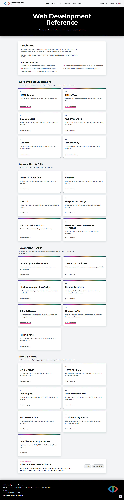
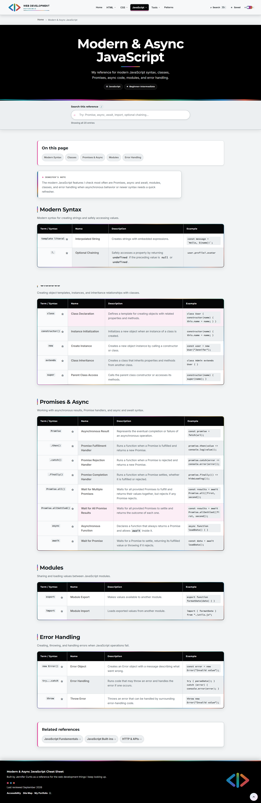
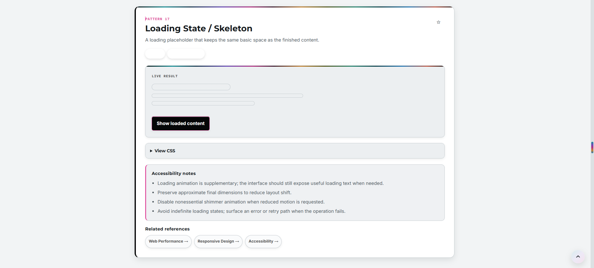
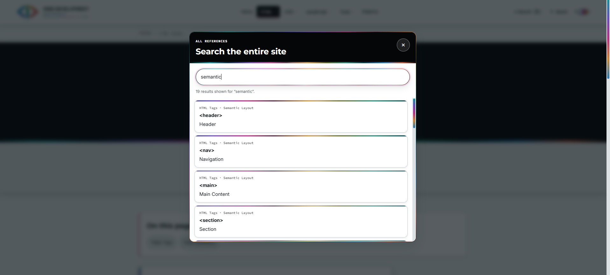
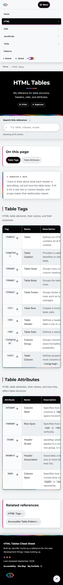
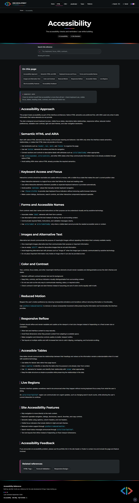
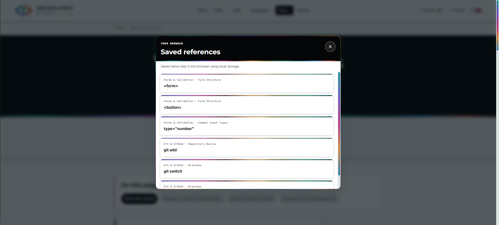
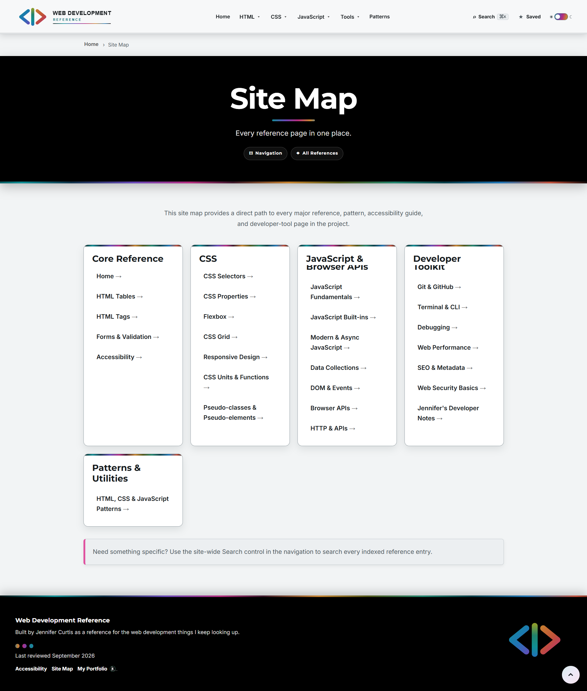

# Web Development Reference

### HTML, CSS, JavaScript and Front-End Development Reference

A multi-page web development reference I built with HTML, CSS, and vanilla JavaScript for the concepts, syntax, patterns, and tools I regularly look up while working on other projects.

It started as an HTML tables cheat sheet because I kept looking up the same things. As I continued learning and building projects, it grew into a larger reference organized around the topics I found myself returning to most often.

I intentionally kept the project framework-free so the reference remains easy to open, understand, maintain, and expand without requiring a build step.

**Live Site:** https://reference.jennifercurtis.me



---

## Project Overview

The reference brings together notes, examples, and interactive demonstrations covering:

- HTML
- CSS
- JavaScript
- Responsive design
- Accessibility
- HTTP and APIs
- Web performance
- Web security
- Git and GitHub
- Terminal and CLI commands
- SEO and metadata
- Debugging
- Reusable front-end patterns

The project serves two purposes: it gives me a practical reference I can use while developing, and it gives me a place to reinforce concepts by organizing and explaining them in my own way.

---

## Key Features

### Development References

- Topic-specific reference pages
- Searchable syntax, concepts, and code examples
- Dedicated HTML, CSS, and JavaScript references
- Git, terminal, API, security, performance, and debugging references
- Responsive design and accessibility guidance
- Reusable front-end patterns

### Search & Saved References

- Page-level search
- Site-wide reference search
- Saved references using `localStorage`
- Search data separated from search behavior
- Direct links to individual reference entries

### Interactive Examples

- Interactive demonstrations on the Patterns page
- Copy controls for code examples
- Dialog and interface demonstrations
- Reusable JavaScript utilities
- Examples designed to demonstrate concepts in the context where they are used

### Accessibility & User Experience

- Semantic HTML
- Keyboard-accessible controls
- Visible focus states
- Accessible labels and status messages
- Reduced-motion support
- Responsive layouts
- Persistent light and dark themes

---

## Project Screenshots

### Reference Home

The home page organizes the reference into the major areas I use while developing and provides direct paths into each topic.

<p align="center">
  
</p>

### Reference Pages

Reference pages use a shared structure for navigation, page-level search, topic navigation, reference tables, saved entries, and related references.

<p align="center">
  
</p>

### Interactive Patterns

The Patterns section includes working demonstrations alongside implementation details, accessibility considerations, and related references.

<p align="center">
  
</p>

### Site-Wide Search

The global search uses the centralized reference index to find entries across the entire site rather than only the current page.

<p align="center">
  
</p>

### Responsive Layout

Navigation, reference content, tables, and shared interface controls adapt for smaller screens.

<p align="center">
  
</p>

### Light and Dark Themes

The shared theme system applies across navigation, reference content, controls, code examples, and supporting interface elements.

<p align="center">
  
</p>

### Saved References

Individual reference entries can be saved in the browser with `localStorage` and accessed from the shared navigation.

<p align="center">
  
</p>

### Site Map

The site map provides another view of the project's information architecture and direct access to each major reference area.

<p align="center">
  
</p>

---
## Application Architecture

The site is a framework-free, multi-page application built with shared styles, reusable JavaScript behavior, and topic-specific reference pages.

### Front End

- HTML5
- CSS3
- Vanilla JavaScript

### Development Tools

- npm
- ESLint
- http-server
- Git
- GitHub

### Design & UX

- Responsive Web Design
- Semantic HTML
- Accessibility
- Reusable CSS
- CSS custom properties
- Light and Dark Theme System

---

## Technical Implementation

The project is organized so content, presentation, search data, and interactive behavior remain separate and maintainable as the reference grows.

Key implementation details include:

- Organized reference content into focused topic-specific pages
- Created reusable CSS variables and shared component styles
- Separated shared utilities from page-specific JavaScript behavior
- Implemented persistent light and dark themes
- Built page-level and site-wide search
- Created a centralized search data index for reference content
- Used `localStorage` for saved references and theme preferences
- Added copy controls for code examples
- Created interactive examples for common front-end patterns
- Added keyboard navigation and visible focus states
- Added reduced-motion support
- Built responsive layouts with Flexbox, Grid, and media queries
- Added custom 404 and site map pages
- Added lightweight development tooling for consistent editor settings and JavaScript linting

---

## Technology Stack

| Category | Technologies |
| --- | --- |
| Structure | HTML5 |
| Styling | CSS3 |
| Interactivity | Vanilla JavaScript |
| Storage | Web Storage / `localStorage` |
| Layout | Flexbox, CSS Grid, Media Queries |
| Code Quality | ESLint |
| Local Development | http-server, npm |
| Version Control | Git, GitHub |

---

## Simplified Project Structure

```text
web-development-reference/
├── assets/
│   ├── css/
│   ├── cursors/
│   ├── images/
│   │   ├── logo/
│   │   │   ├── web-dev-reference-logo.svg
│   │   │   ├── web-dev-reference-logo-dark.svg
│   │   │   └── web-dev-reference-mark.svg
│   │   ├── social/
│   │   │   └── web-dev-reference-social.png
│   │   ├── logo-light-theme.webp
│   │   └── logo-dark-theme.webp
│   └── js/
├── references/
│   ├── css/
│   ├── html/
│   ├── javascript/
│   ├── patterns/
│   └── tools/
├── 404.html
├── apple-touch-icon.png
├── favicon.ico
├── favicon.svg
├── index.html
├── sitemap.html
├── sitemap.xml
├── package.json
├── eslint.config.js
├── .editorconfig
├── .gitignore
└── README.md
```

Reference content is grouped by subject while shared CSS, JavaScript, images, search data, and interface behavior remain centralized under `assets/`.

---

## Running the Project

The site can be opened with a local development server such as VS Code Live Server.

If Node.js is installed, install the development dependencies:

```bash
npm install
```

Start the local development server:

```bash
npm run serve
```

---

## Code Quality

Run ESLint against the JavaScript source:

```bash
npm run lint
```

---

## Performance & Quality Checks

Before publishing a new version, I check the deployed site in Lighthouse and look for problems that affect the actual experience rather than optimizing only for a score.

My main checks include:

- Performance
- Accessibility
- Best Practices
- SEO
- Image dimensions and file sizes
- Unexpected layout movement
- Render-blocking resources
- Keyboard navigation
- Visible focus states
- Reduced-motion behavior
- Broken links
- Console errors

I also review the reference content itself for broken anchors, inconsistent terminology, duplicate IDs, missing search entries, and outdated internal links as the site grows.

---

## Why I Built It

This project started because I wanted a reference that worked the way I naturally look for information while developing.

Building it also became part of the learning process. Instead of only saving links or isolated notes, I have to decide how concepts relate to one another, explain them clearly, create useful examples, and organize them so I can find them again later.

As the site has grown, maintaining it has become an exercise in application structure, consistency, accessibility, search design, reusable front-end behavior, and keeping a larger codebase understandable without introducing a framework just for the sake of using one.

---

## AI Assistance

I used AI as a development assistant for brainstorming, debugging, accessibility checks, code review, and cleanup.

I went back through the project, changed what did not sound or feel like me, verified changes against the project itself, and made sure I understand the code I am publishing.

---

## Creator

**Portfolio:** https://jennifercurtis.me